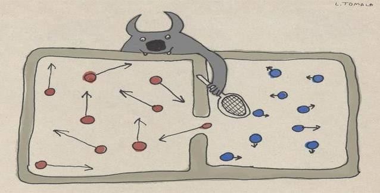

# Maxwell'in cini mi Allah mı? 

Yazımıza başlamadan önce konuyla alakası olan Maxwell'in cini düşünce deneyini açıklamak istiyorum.

----
## Maxwell'in Cini Nedir ?

Özetle James Clarck Maxwell tarafından öne sürülen ve termodinamiğin ikinci yasasının geçerliliğini sorgulamak üzere ortaya atılmış bir düşünce deneyidir.

Bu düşünce deneyinde Maxwell iki kapali oda ve bu odalar arasinda bir tane açılır kapanır deliğe sahip olan bir duvar hayal etmiştir. Bu odalarda başlangıç toplam enerjileri aynı olan gazlar vardır. Odaların üzerinde de duvardaki deliğe yakın olan her gazın enerjisini ölçebilen ve istediğinde kapağı açıp kapatabilen bir cin vardır.

Bu cinin amacı ölçtüğü gaz atomunun enerjisi yüksekse sağdaki odaya enerjisi düşükse soldaki odaya toplamaktır. Zamanla cinin yaptığı bu uygulama sonucunda odalar arasındaki enerji ve basınç farkı giderek artacak ve en sonunda da maximum seviyeye ulaşacaktır. Bu durumda elde edilen enerji ve basınç farki iş yapmak için kullanılacak yani toplam enerjisi sıfır olan bir sisteme dışardan enerji eklemeden o sistem içerisinde iş yapabilme yeteneğine sahip enerji elde edilmiş olacak.

## Maxwell'in Cininin Fotonlar Kullanılarak Canlandırılması

Geçtiğimiz günlerde yayınlanan bir araştırmada araştırmacılar Maxwell'in cinini bir fotodedektör gazları da foton atımları olarak kullanmışlardır. Özetle denek düzeneği şu şekilde:

Foton sayıları birbirinden farklı olan iki farklı atım yapabilen bir foton üreticisi ki bu fotonlar bizim için gaz atomlarını temsil ediyor. Foton sayılarını hesaplayıp fotonları sayılarına göre sağa ya da sola gönderen fotodedektör de Maxwell'in cinini temsil ediyor. Denek düzeneği son derece basit ve düşünce deneyindeki kadar sade olmakla birlikte anlaşılması da bir hayli kolay.

Deneyi yapan araştırmacılar gönderdikleri foton demetlerini sayıp az olanı sol fotodiota çok olanı sağ fotodiota gönderen bir mekanizma yapmışlar. Bu fotodiotlara düşen fotonlar sayılarına bağlı olarak az ya da çok elektrik akımı oluşturuyor. Sağdaki fotodiota düşen foton sayısı daha fazla olduğu için doğal olarak daha fazla akım üretiyor ve soldaki fotodiotta üretilen akımdan daha fazla olduğu için düzeneğe yerleştirilen kapasitör zamanla şarj olmaktadır. Şayet akımlar birbirine eşit olsalardı o zaman akımlar birbirini sönümleyecek ve kapasitör şarj olamayacaktı.

### Bu Deney Bize Ne Söylüyor ?
----
Bu deneyden yola çıkarak söylenecek birkaç şey vardır. Bunlar:
- Sistemin toplam enerjisi sıfır olmasına rağmen sisteme dışardan müdahale etmeksizin sistemde enerji üretilip o enerjiye iş yaptırılmıştır. 
- Sistemin toplam enerjisinin sıfır olması sistemin "Dışarıdan" müdahale olmaksızın iş yapamayacağı anlamına gelmez.
- Yeterli bilgi ve yeterli güç sonucunda toplam enerjisi sıfır olan sisteme iş yaptırabilen "Birisi" olabilir.
- Termodinamiğin 2. yasasının bu deney sonucunda gözden geçirilip gerekirse değiştirmek gerekiyor.

----
## Bu Durumda ALLAH Bu Yazının Neresinde ?
`Yeterli güç ve yeterli bilgiye sahip olan "Birisi" sisteme dışardan enerji aktarmaksızın sistemi kontrol edebilir`

----

Deneyden anlaşıldığı üzere enerjisi sıfır olan sistemde enerji açığı oluşturmadan ve enerji aktarımı yapılmadan o sisteme iş yaptırabilmek mümkündür.

Ateistlerin en çok savunduğu hipotez olan temodinamiğin 2. yasası ve bu hipotez bağlamında iddia edilen:
> Şayet "Tanrı" kainattaki her olayı bire bir kontrol ediyor o halde neden evrende bir enerji akışı göremiyoruz ?
> Nede enerji girişi ya da çıkışı ölçemiyoruz ?

----
> O halde "Dışardan" müdahale söz konusu değildir.

----
----
Hipotezlerin son derece aceleci ve yanlış olduğunu aslında "Dışardan" müdahalenin enerji açığı oluşturmadığını bu deney gözler önüne seriyor. **Allah** her türlü bilgiye ve güce sahip olması sebebiyle toplam enerjisi sıfır olan kainatımızda "Dışardan" kendi kurduğu sisteme müdahale etmeden her olayı kontrol edebiliyor. Bir yaprağın ağaçtan düşerken yer çekiminin yaptığı işi de gen mutasyonlarından genlerin yer değiştirmesine kadar olan her olaydaki enerjiyi ve olayları kontrol ediyor. Bu durumda deney bize "Dışardan" enerji almadan da sistemin kontrol edilebileceğini gösterirken BİZE imanı ve düşünmeyi öğütlüyor. **Allah'ın** bu sonsuz gücü ve her geçen an daha da aydınlatıcı araştırmalar BİZE **Allah'ın** sonsuz gücünü ve dehasını gösteriyor.
